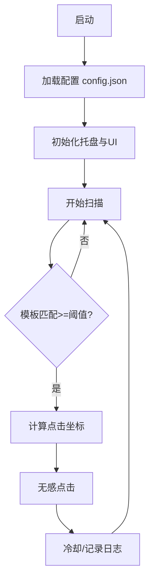

# AI-IDE-Auto-Run
用PySide6做的Windows小工具，解决Trae IDE的“继续”、Windsurf的“Run”、Codex的“Approve”等等，实现AI IDE的自动化运行。


1.当弹出该提示时能自动点击，注意：能无感点击，不影响鼠标、不影响键盘输入等任务

2.占用性能极少

3.能收到右下角的任务栏中后台运行

4.用户决定能否开启log日志功能，如果开启log日志，需要将log日志输出到log.txt文件中，log日志包含时间


5.可以保存配置，通过json文件保存配置

6.用户可截图要无感点击的区域，作为检测目标自行添加


7.多屏幕支持


8.通知提示


## 🌟 主要特性

### 核心功能
- **多模板识别**：支持同时加载多个模板图片，识别不同类型的按钮
- **无感点击**：使用Windows消息机制，不移动系统鼠标，不打断当前操作
- **多屏幕支持**：支持多显示器环境，可指定监控特定屏幕
- **智能匹配**：基于OpenCV模板匹配，支持多尺度检测和灰度匹配
- **托盘常驻**：后台运行，通过系统托盘进行控制
- **单实例运行**：通过QLocalServer保证仅运行一个实例，再次启动会唤起设置窗口
- **ROI区域限制**：可设置感兴趣区域，提高检测效率
- **点击冷却**：防止频繁误点击，可设置点击间隔
- **调试模式**：提供详细的调试信息和坐标验证
- **配置持久化**：所有设置保存为JSON文件，重启后自动恢复
- **日志记录**：可选的文件日志功能，记录运行状态

## 📦 安装要求

### 系统要求
- Windows 10/11
- Python 3.8+

### 依赖包
```
PySide6>=6.5
opencv-python-headless>=4.9.0.80
numpy>=1.24.0,<2.0
mss>=9.0.1
```

### 安装步骤
1. 克隆或下载项目到本地
2. 安装依赖包：
   ```bash
   pip install -r requirements.txt
   ```
3. 运行主程序（推荐PowerShell）：
   ```powershell
   # 一键UTF-8并运行（使用指定conda环境）
   ./scripts/run_app.ps1
   ```
   - 如未找到 `C:/Users/wcx/.conda/envs/use/python.exe`，脚本将自动回退到 `python`（使用当前PATH中的解释器）。

## 🚀 快速开始

### 基本使用
1. **启动程序**：运行 `main_auto_approve.py`
2. **添加模板**：右键托盘图标 → 设置 → 添加要识别的按钮图片
3. **开始扫描**：右键托盘图标 → 开始扫描
4. **停止扫描**：右键托盘图标 → 停止扫描
5. **查看屏幕**：右键托盘图标 → 显示屏幕列表（便于确认多屏信息）
6. 双击托盘图标可直接打开“设置”窗口

### 模板图片准备
- 截取需要自动点击的按钮图片
- 保存为PNG格式
- 建议图片清晰，包含按钮的完整内容
- 通过设置中的“截图添加”可直接取框：会自动在鼠标所在的屏幕进行截取；完成取框后会弹出“截图预览”窗口，点击“保存”写入到 `assets/images`，点击“取消”则不保存。
- 项目已包含常用模板：
  - `approve_pix.png` - 同意按钮
  - `continue.png` - 继续按钮
  - `Runeverytime.png` - 每次运行
  - `Runthistime.png` - 本次运行
  - `Runalt.png` - 运行（备选）
  - `approve2.png`, `approve3.png` - 其他同意按钮样式

## ⚙️ 配置说明

### 主要配置项

#### 基本设置
- **模板路径**：要识别的按钮图片文件路径
- **监视器索引**：指定要监控的屏幕（1=第一个屏幕，2=第二个屏幕...）
- **扫描间隔**：每次扫描的时间间隔（毫秒）
- **匹配阈值**：模板匹配的相似度阈值（0.0-1.0）

#### 高级设置
- **ROI区域**：限制扫描的屏幕区域（x, y, width, height）
- **点击冷却**：两次点击之间的最小间隔（秒）
- **灰度匹配**：是否使用灰度图像进行匹配（提高性能）
- **多尺度检测**：支持不同缩放比例的按钮识别
- **点击偏移**：相对于匹配位置的点击偏移量

#### 多屏幕设置
- **坐标校正**：自动校正多屏幕环境下的坐标
- **增强窗口查找**：提高窗口定位的准确性
- **屏幕轮询**：在多个屏幕间轮流扫描
  - 对应配置：`enable_multi_screen_polling` 与 `screen_polling_interval_ms`

### 配置文件
配置保存在 `config.json` 文件中，可以手动编辑或通过设置界面修改。
为兼容旧版本：当配置中的模板路径文件不存在时，程序会自动在`assets/images/`下按同名文件回退查找。

## 🛠️ 项目结构

```
自动同意小工具添加多组图github/
├── main_auto_approve.py        # 主程序入口（保持主文件命名规范）
├── auto_approve/               # 核心代码包
│   ├── __init__.py
│   ├── config_manager.py       # 配置管理
│   ├── logger_manager.py       # 日志管理
│   ├── scanner_worker.py       # 屏幕扫描线程
│   ├── settings_dialog.py      # 设置对话框
│   ├── screen_list_dialog.py   # 屏幕列表
│   └── win_clicker.py          # Windows无感点击
├── assets/
│   ├── images/                 # 模板图片等
│   │   ├── approve_pix.png
│   │   ├── approve2.png, approve3.png, continue.png, Run*.png, ...
│   ├── styles/
│   │   └── modern_flat.qss     # 样式文件
│   └── icons/
│       ├── custom_icon.ico        # 图标资源（程序当前使用代码绘制托盘图标，此文件可供扩展）
│       ├── check_white_16.png
│       ├── check_white_32.png
│       └── check_white.ico
├── tools/                      # 诊断与开发辅助脚本
│   ├── debug_coordinates.py
│   ├── diagnose_multiscreen_click.py
│   └── fix_multiscreen_config.py
├── scripts/
│   ├── run_app.ps1             # 一键UTF-8并运行（优先conda环境）
│   └── check_config_paths.py   # 校验模板路径存在性的小工具
├── config.json                 # 应用配置（JSON持久化）
├── requirements.txt            # 依赖清单
└── README.md
```



### 核心模块说明

#### main_auto_approve.py
- 程序主入口
- 实现系统托盘功能
- 管理扫描线程的启动和停止
- 提供用户交互界面
- 采用QLocalServer/QLocalSocket实现单实例与二次启动唤起设置

#### scanner_worker.py
- 屏幕扫描核心逻辑
- 使用mss进行高效截屏
- OpenCV模板匹配算法
- 多尺度和多模板支持

#### win_clicker.py
- Windows平台的无感点击实现
- 使用PostMessage发送鼠标消息
- 支持多屏幕坐标转换
- 窗口查找和验证

#### config_manager.py
- 配置文件的加载和保存
- 默认配置管理
- 数据类型定义

#### settings_dialog.py
- 图形化设置界面
- 支持所有配置项的修改
- 实时预览和验证

## 🔧 工具脚本

### 诊断工具
- **diagnose_multiscreen_click.py**：诊断多屏幕点击问题
- **fix_multiscreen_config.py**：自动修复多屏幕配置
- **debug_coordinates.py**：调试坐标计算问题

### 使用方法
```bash
# 诊断多屏幕问题
python tools/diagnose_multiscreen_click.py

# 修复多屏幕配置
python tools/fix_multiscreen_config.py

# 调试坐标
python tools/debug_coordinates.py

# 快速检查当前配置中的模板路径是否存在
python scripts/check_config_paths.py
```

## 🐛 故障排除

### 常见问题

#### 1. 无法识别按钮
- 检查模板图片是否清晰
- 调整匹配阈值（降低threshold值）
- 启用调试模式查看匹配结果
- 尝试不同的缩放比例

#### 2. 多屏幕环境下点击位置不准确
- 运行诊断工具：`python diagnose_multiscreen_click.py`
- 运行修复工具：`python fix_multiscreen_config.py`
- 检查监视器索引设置
- 启用坐标校正功能

#### 3. 点击无效果
- 确认目标窗口支持PostMessage
- 尝试不同的点击方法

## PowerShell UTF-8 终端配置（避免中文乱码）
```powershell
$ErrorActionPreference='Stop';
[Console]::InputEncoding = [Console]::OutputEncoding = New-Object System.Text.UTF8Encoding $false;
$env:PYTHONIOENCODING = 'utf-8';
$PSDefaultParameterValues['Out-File:Encoding'] = 'utf8';
"OK: UTF-8 configured"
```
- 检查窗口权限和状态
- 启用窗口验证功能

#### 4. 性能问题
- 设置合适的ROI区域
- 调整扫描间隔
- 启用灰度匹配
- 减少模板数量

### 调试模式
启用调试模式可以获得详细的运行信息：
1. 在设置中启用"调试模式"
2. 可选启用"保存调试图片"
3. 查看控制台输出或日志文件

## 📝 开发说明

### 技术栈
- **GUI框架**：PySide6 (Qt6)
- **图像处理**：OpenCV
- **屏幕截取**：mss
- **系统交互**：Windows API (ctypes)

### 架构设计
- **模块化设计**：功能分离，便于维护
- **线程安全**：UI线程与工作线程分离
- **配置驱动**：所有行为通过配置文件控制
- **事件驱动**：基于Qt信号槽机制

### 扩展开发
1. **添加新的点击方法**：在 `win_clicker.py` 中实现
2. **支持新的图像格式**：修改 `scanner_worker.py`
3. **添加新的配置项**：更新 `config_manager.py` 和 `settings_dialog.py`
4. **优化匹配算法**：改进 `scanner_worker.py` 中的模板匹配逻辑

## 📄 许可证

本项目仅供学习和个人使用。请遵守相关法律法规，不要用于恶意用途。

## 🤝 贡献

欢迎提交Issue和Pull Request来改进这个项目。

## 📞 支持

如果遇到问题，请：
1. 查看本README的故障排除部分
2. 运行相关的诊断工具
3. 启用调试模式获取详细信息
4. 提交Issue并附上详细的错误信息

---

**注意**：本工具设计用于自动化重复性的点击操作，请确保在合法和适当的场景下使用。
