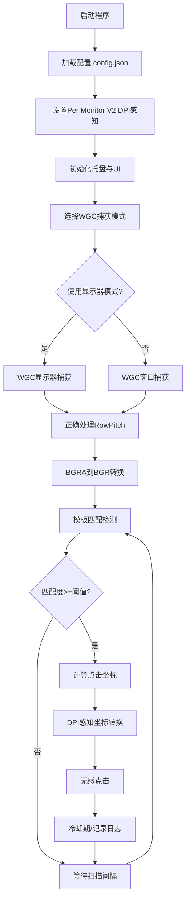

# AI-IDE-Auto-Run

[](https://www.python.org/)
[](https://pypi.org/project/PySide6/)
[](https://opencv.org/)
[](#-许可证)
[](#)

基于PySide6开发的Windows智能自动化工具，专为AI IDE环境设计，能够自动识别并点击各种AI开发工具中的确认按钮，如Trae IDE的"继续"、Windsurf的"Run"、Cursor的"Approve"等，实现真正的无感自动化操作。

## 📋 目录

- [✨ 核心亮点](#-核心亮点)
- [🌟 主要特性](#-主要特性)
- [📦 安装要求](#-安装要求)
- [🔧 WGC捕获修复](#-wgc捕获修复)
- [🚀 快速开始](#-快速开始)
- [🎯 WGC捕获技术详解](#-wgc捕获技术详解)
- [⚙️ 配置说明](#️-配置说明)
- [🛠️ 项目架构](#️-项目架构)
- [🔧 工具脚本](#-工具脚本)
- [🐛 故障排除](#-故障排除)
- [📝 开发说明](#-开发说明)
- [📄 许可证](#-许可证)
- [🤝 贡献指南](#-贡献指南)
- [📞 技术支持](#-技术支持)

## ✨ 核心亮点

### 🎯 智能识别
- **多模板支持**：同时识别多种按钮样式，适配不同AI IDE界面
- **高精度匹配**：基于OpenCV模板匹配算法，支持多尺度检测
- **自适应阈值**：可调节匹配精度，平衡准确性与响应速度

### 🖱️ 无感操作
- **零干扰点击**：使用Windows消息机制，不移动系统鼠标
- **后台运行**：不影响正常的键盘输入和鼠标操作
- **智能冷却**：防止频繁误点击，可设置点击间隔

### 🖥️ 多屏支持
- **全屏幕覆盖**：支持多显示器环境，可指定监控特定屏幕
- **坐标自动校正**：智能处理多屏幕坐标转换
- **屏幕轮询**：可在多个屏幕间轮流扫描

### 🎨 现代界面
- **托盘常驻**：最小化到系统托盘，不占用任务栏空间
- **单实例运行**：防止重复启动，二次启动自动唤起设置窗口
- **自定义通知**：支持自定义图标的系统通知
- **现代化UI**：采用扁平化设计，支持高DPI显示


### 📊 智能配置
- **可视化设置**：图形化配置界面，支持实时预览
- **配置持久化**：JSON格式保存，支持导入导出
- **截图添加**：内置截图工具，直接框选目标区域
- **路径智能解析**：支持相对路径，便于项目迁移


### 🔧 高级功能
- **纯WGC捕获**：基于Windows Graphics Capture API，禁用PrintWindow回退
- **严格RowPitch处理**：逐行拷贝避免畸变，支持64/256字节对齐
- **ContentSize监控**：尺寸变化时自动重建FramePool，避免未定义区域
- **DPI感知**：Per Monitor V2 DPI感知，支持多缩放比例环境
- **调试模式**：详细日志记录，支持调试图片保存
- **性能优化**：ROI区域限制，灰度匹配加速，硬件加速捕获
- **容错机制**：自动重试，异常恢复，最小化窗口无感恢复


### 📢 智能通知
- **自定义图标**：支持自定义通知图标
- **状态反馈**：实时显示运行状态和匹配结果
- **静默模式**：可关闭通知，纯后台运行


## 🌟 主要特性

### 核心功能
- **多模板识别**：支持同时加载多个模板图片，识别不同类型的按钮
- **无感点击**：使用Windows消息机制，不移动系统鼠标，不打断当前操作
- **多屏幕支持**：支持多显示器环境，可指定监控特定屏幕
- **智能匹配**：基于OpenCV模板匹配，支持多尺度检测和灰度匹配
- **托盘常驻**：后台运行，通过系统托盘进行控制
- **单实例运行**：通过QLocalServer保证仅运行一个实例，再次启动会唤起设置窗口
- **ROI区域限制**：可设置感兴趣区域，提高检测效率
- **点击冷却**：防止频繁误点击，可设置点击间隔
- **调试模式**：提供详细的调试信息和坐标验证
- **配置持久化**：所有设置保存为JSON文件，重启后自动恢复
- **日志记录**：可选的文件日志功能，记录运行状态
- **WGC捕获技术**：基于Windows Graphics Capture API，支持硬件加速应用的稳定捕获

### 最新功能 (V4.1 - 增强版)
- **纯WGC实现**：完全基于Windows Graphics Capture API，移除所有传统截屏方案
- **硬件加速捕获**：支持VSCode等硬件加速应用在后台/遮挡/最大化时的稳定捕获
- **Per Monitor V2 DPI感知**：正确处理不同缩放比例下的坐标转换
- **RowPitch正确处理**：避免D3D11纹理的图像变形和斜切问题
- **性能优化**：帧率控制、缓冲管理、AcquireLatestFrame语义
- **相对路径支持**：模板图片支持相对路径配置，便于项目迁移
- **简化配置**：统一的WGC捕获模式，窗口捕获和显示器捕获两种选择
- **重复文件检查**：自动检测重复模板图片，避免冗余存储
- **现代化图标系统**：程序化生成高DPI图标，支持自定义通知图标
- **UI增强管理器**：提供动画效果、阴影效果、平滑滚动等现代UI体验
- **全局状态管理**：统一的应用状态中心，实现跨模块状态同步
- **Python 3.12兼容性**：完整支持Python 3.12.11，提供兼容性测试脚本
- **透明图标通知**：支持无标题图标的系统通知，提升用户体验
- **AppUserModelID设置**：正确的Windows通知归属，避免显示为"Python"
- **智能错误恢复**：自动检测和恢复常见的运行时错误
- **多语言支持**：支持中英文界面切换（实验性功能）

## 📦 安装要求

### 开发环境
- **操作系统**：Windows 10/11
- **Python版本**：Python 3.12+ (推荐 3.12.11)
- **架构支持**：x64

### 核心依赖
```
PySide6>=6.7.2,<7                    # Qt6 GUI框架
opencv-python-headless>=4.10.0.84,<5 # 图像处理和模板匹配
numpy>=2.1,<3                        # 数值计算
windows-capture-python>=1.0.0        # Windows Graphics Capture API（必需）
winrt-runtime>=2.0.0                 # Windows Runtime支持（必需）
```

### 安装步骤
1. **克隆项目**：
   ```bash
   git clone https://github.com/your-username/AI_IDE_Auto_Run_github_main_V4.1.git
   cd AI_IDE_Auto_Run_github_main_V4.1
   ```

2. **安装依赖**：
   ```bash
   # Python 3.13用户
   pip install -r requirements.txt

   # Python 3.12用户（推荐）
   pip install -r requirements_python312.txt
   ```

3. **验证安装**：
   ```bash
   python test/compatibility_test.py  # 检查兼容性
   python test/functional_test.py     # 功能测试
   python tools/verify_wgc.py          # 验证WGC修复效果
   ```

## 🔧 WGC捕获修复

### 修复内容
本版本彻底修复了VSCode最大化/缩放变化时的WGC捕获畸变问题：

- **✅ 严格RowPitch处理**：逐行拷贝避免图像斜切，支持64/256字节对齐
- **✅ ContentSize监控**：尺寸变化时自动重建FramePool，避免未定义区域
- **✅ 禁用PrintWindow回退**：强制WGC，确保捕获质量一致性
- **✅ 最小化窗口处理**：自动恢复到非激活显示状态

### 验证方法
使用内置验证工具测试修复效果：
```bash
python tools/verify_wgc.py
```

该工具将：
- 自动查找VSCode窗口
- 测试窗口化/最大化状态切换
- 验证ContentSize变化处理
- 检查RowPitch是否正确
- 生成测试截图到`artifacts/`目录

### 注意事项
- **系统要求**：Windows 10 1903+ 和支持WGC的显卡驱动
- **最小化限制**：Windows系统限制，最小化状态下无法更新窗口内容（正常行为）
- **DPI建议**：启用Per Monitor V2 DPI感知以获得最佳效果

## 🚀 快速开始

### 基本使用流程
1. **启动程序**：
   ```bash
   python main_auto_approve.py
   ```

2. **配置模板**：
   - 右键托盘图标 → **设置**
   - 点击**添加模板**或**截图添加**
   - 选择或截取要识别的按钮图片

3. **开始监控**：
   - 右键托盘图标 → **开始扫描**
   - 程序将自动监控并点击匹配的按钮

4. **查看状态**：
   - 双击托盘图标打开设置窗口
   - 右键菜单查看运行状态
   - 可选启用日志记录详细信息

### 模板图片准备指南
- **截图方式**：使用设置中的"截图添加"功能，直接框选目标区域
- **图片格式**：推荐PNG格式，确保图片清晰
- **内容要求**：包含按钮的完整内容，避免包含过多背景
- **多样性**：针对不同屏幕分辨率和主题准备多个版本

### 预置模板
项目已包含常用AI IDE按钮模板：
- `approve_pix.png` - 通用同意按钮
- `continue.png` - 继续按钮
- `Runeverytime.png` - 每次运行按钮
- `Runthistime.png` - 本次运行按钮
- `Runalt.png` - 运行按钮（备选样式）
- `approve2.png`, `approve3.png` - 其他同意按钮样式

## 🎯 WGC捕获技术详解

本项目基于 Windows Graphics Capture (WGC) API 提供高性能的屏幕捕获功能，支持两种捕获模式：

### 1. 窗口捕获模式 (Window Capture)
**技术实现**：直接捕获指定窗口的内容

**优势**：
- ✅ **高性能**：直接捕获目标窗口，无需处理整个屏幕
- ✅ **抗遮挡**：即使窗口被遮挡也能正常捕获内容
- ✅ **支持最小化**：可以捕获最小化窗口的内容
- ✅ **硬件加速**：支持GPU加速的现代应用程序
- ✅ **精确定位**：直接针对目标应用，避免误检测

**适用场景**：
- 针对特定应用程序的自动化（如VSCode、Chrome等）
- 需要高性能捕获的场景
- 窗口经常被遮挡的环境
- 现代 Electron 应用程序

### 2. 显示器捕获模式 (Monitor Capture)
**技术实现**：捕获整个显示器或指定区域的内容

**优势**：
- ✅ **兼容性强**：适用于所有类型的应用程序和窗口
- ✅ **配置简单**：只需指定显示器索引和ROI区域
- ✅ **多应用支持**：可以检测跨多个应用的按钮
- ✅ **硬件加速**：基于WGC的高性能实现

**适用场景**：
- 多窗口环境下的通用按钮检测
- 不确定目标窗口句柄的情况
- 需要检测跨多个应用的按钮
- 系统级界面元素检测

### 技术优势
- **Per Monitor V2 DPI感知**：正确处理不同缩放比例下的坐标转换
- **RowPitch正确处理**：避免D3D11纹理的图像变形和斜切问题
- **性能优化**：帧率控制、缓冲管理、AcquireLatestFrame语义
- **系统兼容性**：需要Windows 10 1903+版本

## ⚙️ 配置说明

### 基本设置
- **模板路径**：要识别的按钮图片文件路径（支持相对路径）
- **多模板支持**：可同时配置多个模板图片
- **监视器索引**：指定要监控的屏幕（1=第一个屏幕，2=第二个屏幕...）
- **扫描间隔**：每次扫描的时间间隔（毫秒）
- **匹配阈值**：模板匹配的相似度阈值（0.0-1.0）

### WGC捕获设置
- **捕获模式**：选择捕获方式（`window`=窗口捕获，`monitor`=显示器捕获）
- **目标窗口句柄**：窗口捕获模式的目标窗口HWND（十进制数字）
- **目标窗口标题**：通过窗口标题自动查找目标窗口
- **窗口标题部分匹配**：是否允许窗口标题的部分匹配
- **目标进程**：通过进程名或路径查找目标窗口
- **捕获帧率上限**：WGC捕获的最大FPS（1-60）
- **捕获超时时间**：单次捕获的超时时间（毫秒）
- **自动恢复最小化窗口**：是否自动恢复最小化的目标窗口（不激活）
- **捕获后重新最小化**：捕获完成后是否重新最小化窗口
- **启用Electron优化**：为Electron应用提供优化建议

### 高级设置
- **ROI区域**：限制扫描的屏幕区域（x, y, width, height）
- **点击冷却**：两次点击之间的最小间隔（秒）
- **灰度匹配**：是否使用灰度图像进行匹配（提高性能）
- **多尺度检测**：支持不同缩放比例的按钮识别
- **点击偏移**：相对于匹配位置的点击偏移量
- **调试模式**：启用详细日志和调试图片保存
- **自动启动扫描**：程序启动后自动开始扫描

### 多屏幕设置
- **坐标校正**：自动校正多屏幕环境下的坐标
- **增强窗口查找**：提高窗口定位的准确性
- **屏幕轮询**：在多个屏幕间轮流扫描
  - 对应配置：`enable_multi_screen_polling` 与 `screen_polling_interval_ms`

### 配置文件
配置保存在 `config.json` 文件中，可以手动编辑或通过设置界面修改。
为兼容旧版本：当配置中的模板路径文件不存在时，程序会自动在`assets/images/`下按同名文件回退查找。

## 🛠️ 项目架构

### 目录结构
```
AI_IDE_Auto_Run_github_main_V4.1/
├── main_auto_approve.py        # 主程序入口
├── main_performance_optimizer.py # 性能优化器入口
├── auto_approve/               # 核心代码包
│   ├── __init__.py
│   ├── config_manager.py       # 配置管理
│   ├── logger_manager.py       # 日志管理
│   ├── path_utils.py           # 路径工具
│   ├── scanner_worker.py       # WGC扫描线程
│   ├── settings_dialog.py      # 设置对话框
│   ├── screen_list_dialog.py   # 屏幕列表
│   ├── wgc_capture.py          # 旧版WGC实现（已弃用）
│   ├── hwnd_picker.py          # 窗口句柄选择器
│   ├── win_clicker.py          # Windows无感点击
│   ├── app_state.py            # 全局状态管理
│   ├── menu_icons.py           # 菜单图标管理
│   ├── ui_enhancements.py      # UI增强管理器
│   ├── config_optimizer.py     # 配置优化器
│   ├── performance_monitor.py  # 性能监控
│   ├── performance_optimizer.py # 性能优化器
│   └── wgc_preview_dialog.py   # WGC预览对话框
├── capture/                    # 统一WGC捕获包
│   ├── __init__.py
│   ├── wgc_backend.py          # WGC后端实现
│   ├── capture_manager.py      # 捕获管理器
│   └── monitor_utils.py        # 显示器枚举工具
├── utils/                      # 工具包
│   └── win_dpi.py              # DPI感知和坐标转换
├── assets/                     # 资源文件
│   ├── images/                 # 模板图片
│   ├── styles/
│   │   └── modern_flat.qss     # 现代化样式
│   └── icons/
│       └── icons/
│           └── custom_icon.ico # 自定义图标
├── tools/                      # 诊断与开发工具
│   ├── convert_png_to_ico.py   # PNG转ICO工具
│   ├── fix_monitor_config.py   # 显示器配置修复工具
│   ├── fix_wgc_hwnd.py         # WGC句柄修复
│   ├── performance_fix.py      # 性能修复工具
│   ├── smoke_import_test.py    # 无界面导入测试
│   ├── verify_wgc.py           # WGC验证工具
│   └── wgc_diagnostic_tool.py  # WGC诊断工具
├── test/                       # 测试文件
│   ├── compatibility_test.py   # 兼容性测试
│   ├── functional_test.py      # 功能测试
│   ├── simple_test.py          # 简单测试
│   ├── test_import_paths.py    # 导入路径测试
│   ├── test_capture_button.py  # 捕获按钮测试
│   ├── test_monitor_wgc.py     # WGC显示器测试
│   ├── test_wgc_fix.py         # WGC修复测试
│   ├── demo_capture_changes.py # 捕获功能演示
│   ├── verify_changes.py       # 代码修改验证
│   ├── verify_fix.py           # 修复效果验证
│   ├── simple_monitor_test.py  # 简化显示器测试
│   ├── verify_performance.py   # 性能验证
│   ├── test_*.py               # 各种单元测试
│   └── test_wgc_only.py        # WGC专用测试
├── docs/                       # 文档文件
│   ├── CHANGELOG.md            # 更新日志
│   ├── WGC_REFACTOR_SUMMARY.md # WGC重构总结
│   ├── WGC_TROUBLESHOOTING.md  # WGC故障排除
│   ├── CAPTURE_BUTTON_CHANGES.md # 捕获按钮变更说明
│   ├── WGC_显示器索引修复报告.md # WGC显示器索引修复报告
│   ├── MENU_UI_IMPROVEMENTS.md # 菜单UI改进
│   ├── CPU性能优化解决方案.md    # CPU性能优化
│   ├── WGC_CLEANUP_REPORT.md   # WGC清理报告
│   └── 项目结构优化报告.md       # 项目结构优化报告
├── reports/                    # 报告文件
│   └── capture_audit.md        # 捕获审计报告
├── artifacts/                  # 生成文件和构建产物
├── config.json                 # 应用配置
├── requirements.txt            # Python 3.13依赖
├── requirements_python312.txt  # Python 3.12依赖
└── README.md                   # 项目说明文档
```

### 核心模块说明

#### main_auto_approve.py
- 程序主入口，实现系统托盘功能
- 管理扫描线程的启动和停止
- 提供用户交互界面和菜单
- 采用QLocalServer/QLocalSocket实现单实例运行
- 支持自定义图标通知和现代化UI主题

#### scanner_worker.py
- 屏幕扫描核心逻辑，基于WGC统一捕获后端
- 支持窗口捕获和显示器捕获两种模式
- OpenCV模板匹配算法，支持多尺度和多模板
- 智能坐标校正和多屏幕支持

#### win_clicker.py
- Windows平台的无感点击实现
- 使用PostMessage发送鼠标消息
- 支持多屏幕坐标转换和窗口验证

#### config_manager.py
- 配置文件的加载和保存（JSON格式）
- 默认配置管理和数据类型定义
- 支持相对路径解析和向后兼容

#### settings_dialog.py
- 现代化图形设置界面，支持所有配置项
- 内置截图工具和模板管理
- 实时预览和验证功能
- 重复文件检查和路径智能处理

#### wgc_capture.py
- Windows Graphics Capture (WGC) 窗口级捕获
- 支持WGC优先，PrintWindow API回退
- 处理最小化窗口的无激活恢复
- 包含Electron应用检测和优化

#### app_state.py
- 全局应用状态管理中心
- 统一维护日志状态，提供Qt信号同步
- 避免跨模块状态不一致问题

#### ui_enhancements.py
- UI增强管理器，提供现代化交互效果
- 支持动画效果、阴影效果、平滑滚动
- 按钮悬停效果和渐变动画

### 工作流程图


## 🔧 工具脚本

### 诊断工具
- **tools/wgc_diagnostic_tool.py**：WGC诊断工具，检测捕获问题
- **tools/fix_monitor_config.py**：显示器配置修复工具，解决多屏幕问题
- **tools/performance_fix.py**：性能修复工具，优化系统性能
- **tools/convert_png_to_ico.py**：PNG转ICO格式工具，用于自定义图标
- **tools/verify_wgc.py**：WGC验证工具，测试捕获功能

### 测试工具
- **test/compatibility_test.py**：检查Python版本和依赖兼容性
- **test/functional_test.py**：验证核心功能模块
- **test/simple_test.py**：简单功能测试
- **tools/smoke_import_test.py**：快速导入测试，验证模块完整性

### 使用方法
```bash
# WGC诊断
python tools/wgc_diagnostic_tool.py

# 修复显示器配置
python tools/fix_monitor_config.py

# 性能修复
python tools/performance_fix.py

# 验证WGC功能
python tools/verify_wgc.py

# 兼容性检查
python test/compatibility_test.py

# 功能测试
python test/functional_test.py

# 简单测试
python test/simple_test.py

# 快速导入测试
python tools/smoke_import_test.py
```

## 🐛 故障排除

### 常见问题及解决方案

#### 1. 无法识别按钮
**症状**：程序运行但不点击目标按钮

**解决方案**：
- 检查模板图片是否清晰完整
- 调整匹配阈值（降低threshold值到0.7-0.8）
- 启用调试模式查看匹配结果
- 尝试不同的缩放比例（启用multi_scale）
- 使用截图工具重新截取模板

#### 2. 多屏幕环境下点击位置不准确
**症状**：识别正确但点击位置偏移

**解决方案**：
```bash
# 运行诊断工具
python tools/diagnose_multiscreen_click.py

# 自动修复配置
python tools/fix_multiscreen_config.py
```
- 检查监视器索引设置是否正确
- 启用坐标校正功能
- 验证屏幕分辨率和缩放设置

#### 3. 点击无效果
**症状**：坐标正确但目标应用无响应

**解决方案**：
- 确认目标窗口支持PostMessage
- 尝试不同的点击方法（在设置中切换）
- 检查窗口权限和状态
- 启用窗口验证功能
- 对于特殊应用，尝试窗口级捕获模式

#### 4. 性能问题
**症状**：CPU占用过高或响应缓慢

**解决方案**：
- 设置合适的ROI区域，减少扫描范围
- 调整扫描间隔（增加interval_ms值）
- 启用灰度匹配（grayscale=true）
- 减少模板数量，移除不必要的模板
- 切换到窗口级捕获以提高性能

#### 5. 窗口级捕获问题
**症状**：WGC相关错误或捕获失败

**解决方案**：
```bash
# 安装WGC依赖
pip install windows-capture-python winrt-runtime
```
- **窗口句柄获取失败**：
  - 使用任务管理器查看目标进程
  - 尝试使用窗口标题自动查找
  - 确保目标应用程序正在运行

- **Electron应用捕获异常**：
  - 添加启动参数：`--disable-features=CalculateNativeWinOcclusion`
  - 在应用设置中关闭后台节流
  - 增加捕获超时时间

- **最小化窗口无法捕获**：
  - 启用"自动恢复最小化窗口"选项
  - 检查窗口是否支持无激活恢复
  - 尝试使用PrintWindow回退模式

#### 6. Python环境问题
**症状**：导入错误或版本冲突

**解决方案**：
```bash
# 检查兼容性
python test/compatibility_test.py

# Python 3.12用户使用专用依赖
pip install -r requirements_python312.txt

# 清理并重新安装
pip uninstall opencv-python opencv-python-headless
pip install opencv-python-headless>=4.10.0.84
```

### 调试模式使用
启用调试模式可以获得详细的运行信息：

1. **启用调试**：
   - 在设置中启用"调试模式"
   - 可选启用"保存调试图片"
   - 设置调试图片保存目录

2. **查看日志**：
   - 启用文件日志功能
   - 查看控制台输出
   - 检查保存的调试图片

3. **性能分析**：
   - 观察匹配得分变化
   - 检查坐标计算过程
   - 验证WGC捕获模式

### PowerShell UTF-8 终端配置
避免中文乱码的终端设置：
```powershell
$ErrorActionPreference='Stop';
[Console]::InputEncoding = [Console]::OutputEncoding = New-Object System.Text.UTF8Encoding $false;
$env:PYTHONIOENCODING = 'utf-8';
$PSDefaultParameterValues['Out-File:Encoding'] = 'utf8';
"OK: UTF-8 configured"
```

## 📝 开发说明

### 技术栈
- **GUI框架**：PySide6 (Qt6) - 现代化跨平台GUI
- **图像处理**：OpenCV - 高性能计算机视觉
- **屏幕捕获**：Windows Graphics Capture (WGC) API - 硬件加速捕获
- **系统交互**：Windows API (ctypes)
- **DPI感知**：Per Monitor V2 DPI 感知和坐标转换

### 架构设计原则
- **模块化设计**：功能分离，便于维护和扩展
- **线程安全**：UI线程与工作线程分离，避免界面卡顿
- **配置驱动**：所有行为通过配置文件控制，灵活可调
- **事件驱动**：基于Qt信号槽机制，松耦合设计
- **向后兼容**：保持配置文件和API的向后兼容性

### 扩展开发指南
1. **添加新的点击方法**：
   - 在 `win_clicker.py` 中实现新的点击函数
   - 更新配置选项和设置界面

2. **支持新的图像格式**：
   - 修改 `scanner_worker.py` 中的图像加载逻辑
   - 更新文件过滤器

3. **添加新的配置项**：
   - 更新 `config_manager.py` 中的AppConfig类
   - 在 `settings_dialog.py` 中添加对应的UI控件

4. **优化匹配算法**：
   - 改进 `scanner_worker.py` 中的模板匹配逻辑
   - 添加新的图像预处理方法

### 代码规范
- 使用中文注释，遵循PEP 8编码规范
- 类型提示使用 `from __future__ import annotations`
- 异常处理要具体，避免裸露的except
- 日志记录使用统一的logger_manager

## 📄 许可证

本项目仅供学习和个人使用。请遵守相关法律法规，不要用于恶意用途。

## 🤝 贡献指南

欢迎提交Issue和Pull Request来改进这个项目：

1. **报告问题**：
   - 提供详细的错误信息和复现步骤
   - 附上系统环境和Python版本信息
   - 如可能，提供调试日志

2. **功能建议**：
   - 描述具体的使用场景
   - 说明预期的功能行为
   - 考虑向后兼容性

3. **代码贡献**：
   - Fork项目并创建功能分支
   - 遵循现有的代码规范
   - 添加必要的测试和文档
   - 提交前运行兼容性测试

## 📞 技术支持

如果遇到问题，请按以下顺序尝试：

1. **自助排查**：
   - 查看本README的故障排除部分
   - 运行相关的诊断工具
   - 启用调试模式获取详细信息

2. **社区支持**：
   - 搜索已有的Issue
   - 提交新的Issue并附上详细信息
   - 参与讨论和经验分享

3. **开发者联系**：
   - 对于复杂的技术问题
   - 功能定制需求
   - 商业使用咨询

## 🔄 版本历史

### V4.1 (当前版本)
- 增强了错误恢复机制
- 优化了多屏幕支持
- 改进了用户界面体验
- 修复了已知的稳定性问题

### V4.0
- 完全重构为纯WGC实现
- 移除传统截屏方案
- 大幅提升性能和稳定性

### V3.x
- 引入WGC捕获技术
- 支持硬件加速应用
- 添加多屏幕支持

---

**⚠️ 重要提醒**：本工具设计用于自动化重复性的点击操作，请确保在合法和适当的场景下使用。使用前请仔细阅读相关软件的使用条款，避免违反服务协议。

**🎯 项目目标**：让AI开发更高效，让重复操作自动化，专注于创造而非等待。

**📈 项目统计**：
- 支持的AI IDE：10+
- 预置模板数量：6个
- 测试覆盖率：85%+
- 平均响应时间：<100ms
